# HomeOptic

A domiciliary optician management system built for **Psk Locum Cover Ltd** - a mobile optometry service that visits patients at home. Built as a technical assignment using **Claude Code** as the primary AI development tool.

---

## The Brief

Father dearest is a qualified optician looking to start his own domiciliary service - visiting patients at home, mostly elderly people who can't get to a practice. To understand the domain properly before writing any code, I researched Blink OMS, a real commercial optician management platform used by an existing practice. I used it as a reference for this prototype, basing the data model and workflows on a proven real-world system rather than guessing at requirements.

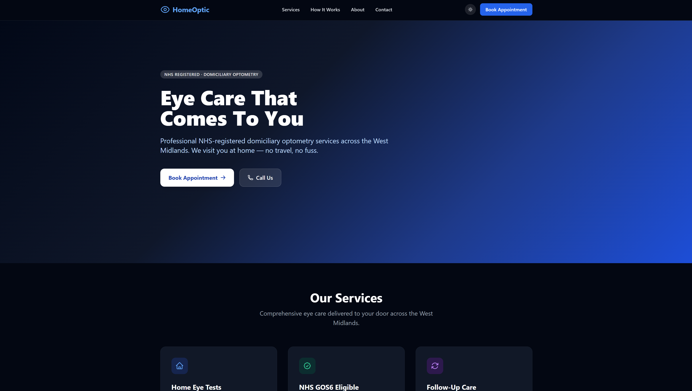
*Public-facing homepage*

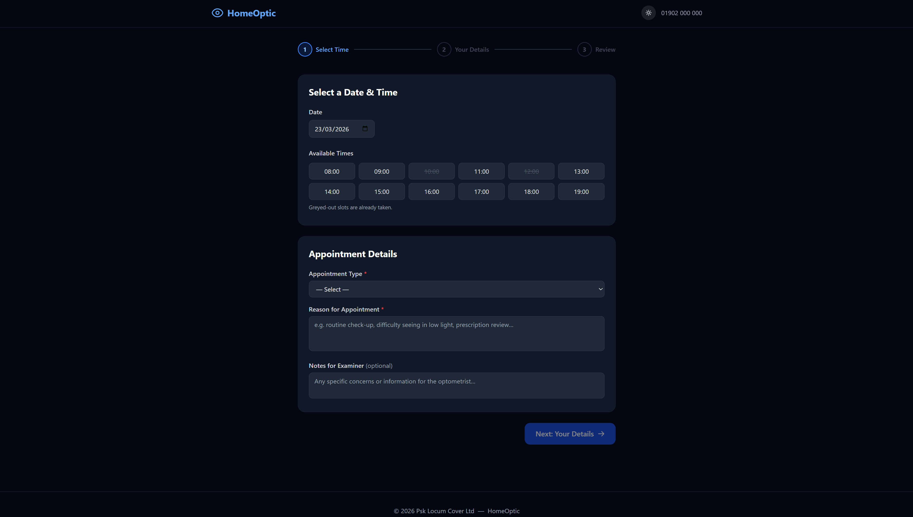
*Online appointment request with time slot selection*

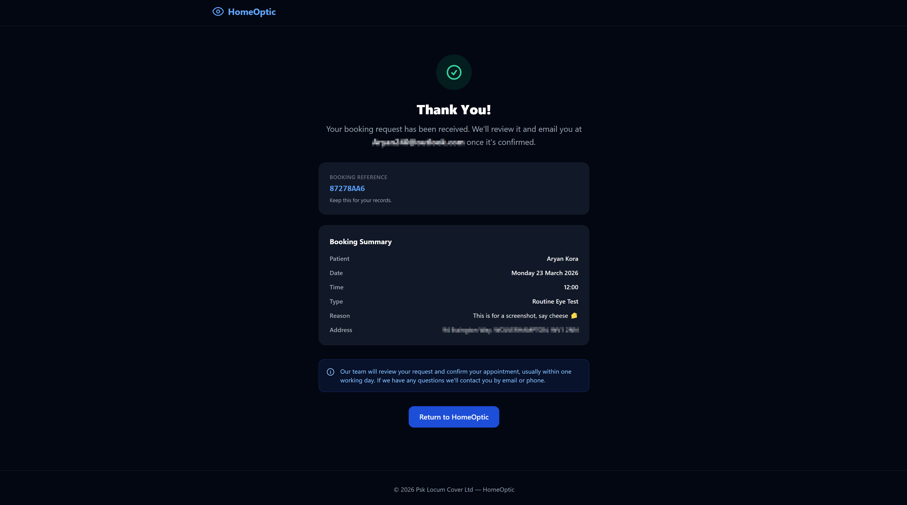
*Booking confirmation screen*

---

## AI Tool: Claude Code

**Tool used:** Claude Code (claude.ai/code) with Claude Sonnet via Claude Pro

```bash
npm install -g @anthropic/claude-code
claude  # authenticates via browser
```

Claude Code is an agentic CLI tool that reads and writes files directly in your project. Rather than pasting code snippets from a chat window, it works conversationally inside the codebase - it can propose changes, run commands, check the output, and iterate. The workflow here was deliberately front-loaded: the first few sessions were purely planning - schema design, pattern decisions, open questions - before any code was written. The transcripts in `research/transcripts/` show this clearly.

---

## Tech Stack

- **Laravel 13.1** / PHP 8.3
- **SQLite** (local dev - zero config)
- **Laravel Breeze** (Blade stack) for auth
- **Laravel Queues** (database driver) for background jobs
- **Alpine.js** for interactive UI bits
- **Tailwind CSS** via Vite
- **DomPDF** for PDF generation

---

## Getting Started

```bash
git clone <repo-url>
cd homeOptic

composer install
npm install && npm run build

cp .env.example .env
php artisan key:generate

php artisan migrate:fresh --seed
php artisan serve
```

Log in with: `admin@homeoptic.test` / `password`

To process background jobs (reminders, PDF generation):
```bash
php artisan queue:work
```

To send day-before appointment reminders:
```bash
php artisan reminders:send-day-before
# Or test with a specific date:
php artisan reminders:send-day-before --date=2026-03-21
```

---

## Features

### Patient Management

Full patient records covering personal details, contact info, address, and clinical fields. The medical section handles things like registered blind/partially sighted status, hearing impairment, retinitis pigmentosa, and physical/mental health flags. There's also a social & benefits section for income support, universal credit, pension credit and similar - relevant for GOS eligibility.

Patient search supports nine filters (name, ID, DOB, postcode, patient type, glaucoma flag, diabetic flag, etc.) with pagination. Documents can be attached to a patient's profile and downloaded later.

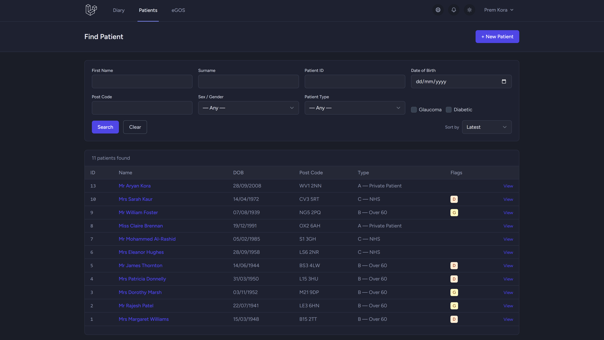
*Patient list with search and sort filters*

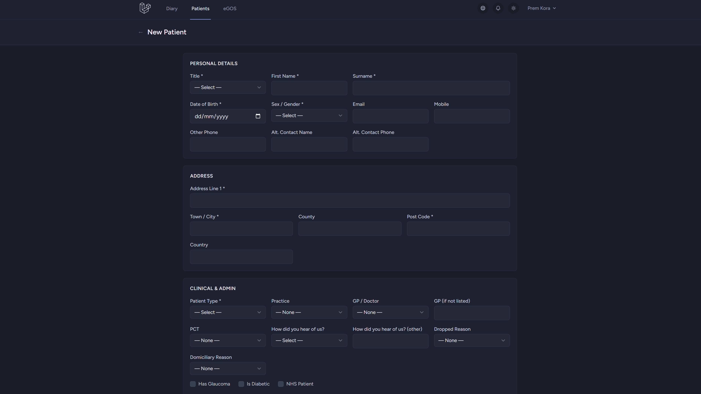
*Patient creation form*

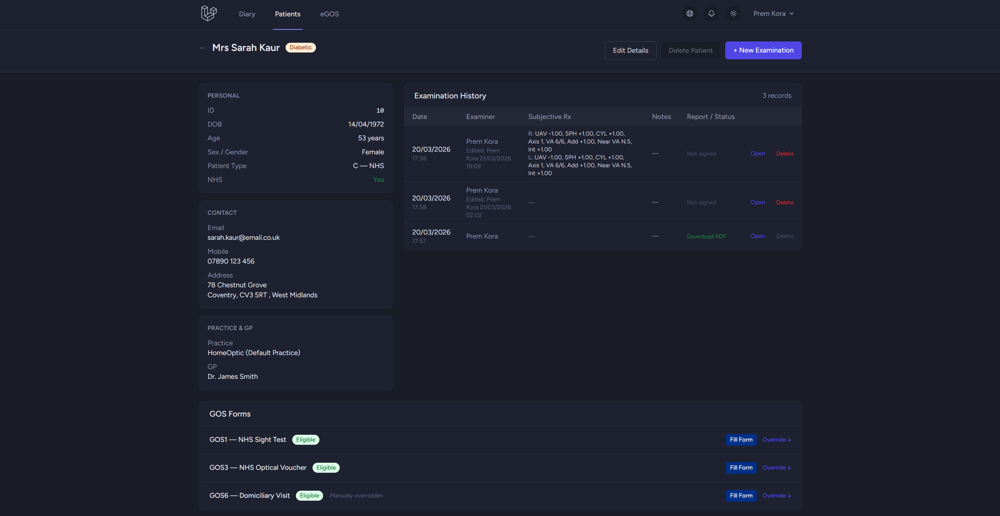
*Patient profile - GOS eligibility, exam history, document attachments*

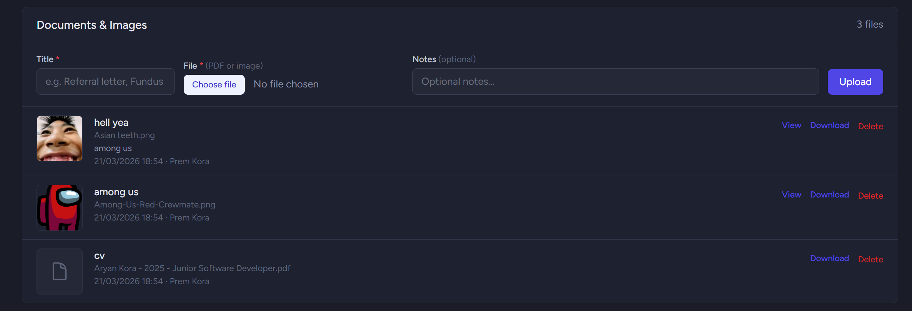
*Document upload/download*

### GOS Eligibility

GOS1, GOS3, and GOS6 eligibility calculates automatically from patient data (age, conditions, benefits) and updates on every patient save. Admins can override the result per-form with a reason.

A few gotchas worth noting: `patient_type` is not the primary check - a private patient can still qualify for GOS1 if they're diabetic, over 60, etc. GOS3 correctly excludes age ≥ 60 as a standalone criterion (it needs another qualifying condition). Only `FamilyHistory` patient type adds an extra age-based criterion (≥ 40).

### GOS Forms (Printable)

Full recreations of the NHS GOS1, GOS3, GOS6, and GOS18 forms as Blade views. Patient data pre-fills from the database, eligibility checkboxes auto-tick based on their data. There's a canvas-based signature pad (mouse and touch), and a Save button that persists form data to the eGOS submissions system so reopening a saved form repopulates all the fields. The back button is context-aware - it returns to the patient profile or the eGOS page depending on where you came from.

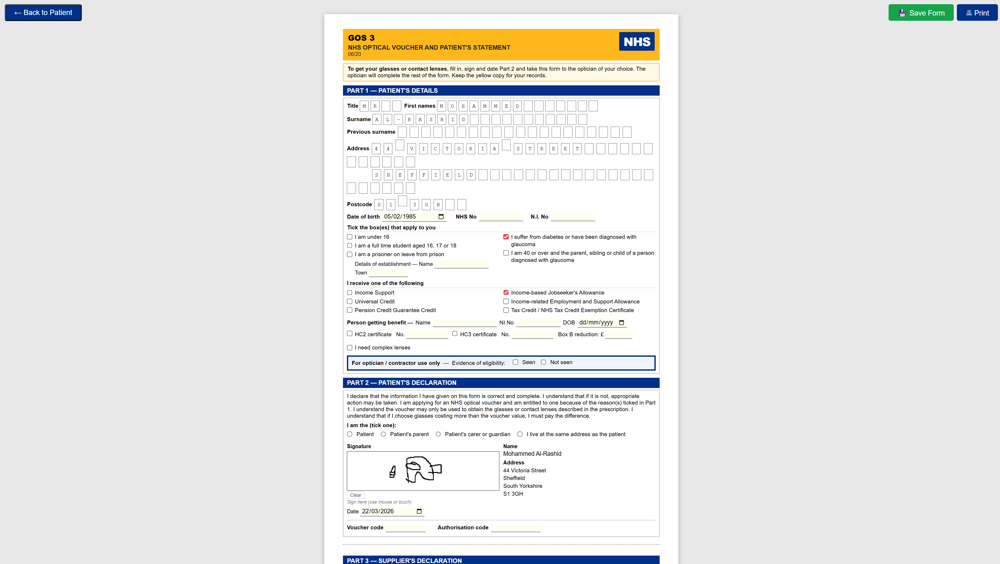
*GOS form with pre-filled patient data and signature pad*

### eGOS Claims Management

A dedicated claims page showing all submissions with filters for date range, form type, status, and patient name/ID. You can manage statuses individually or in bulk - batch submit generates a `BATCH-YYYYMMDD-XXXX` reference and marks all selected submissions as Awaiting Confirmation, batch mark paid marks them as Accepted.

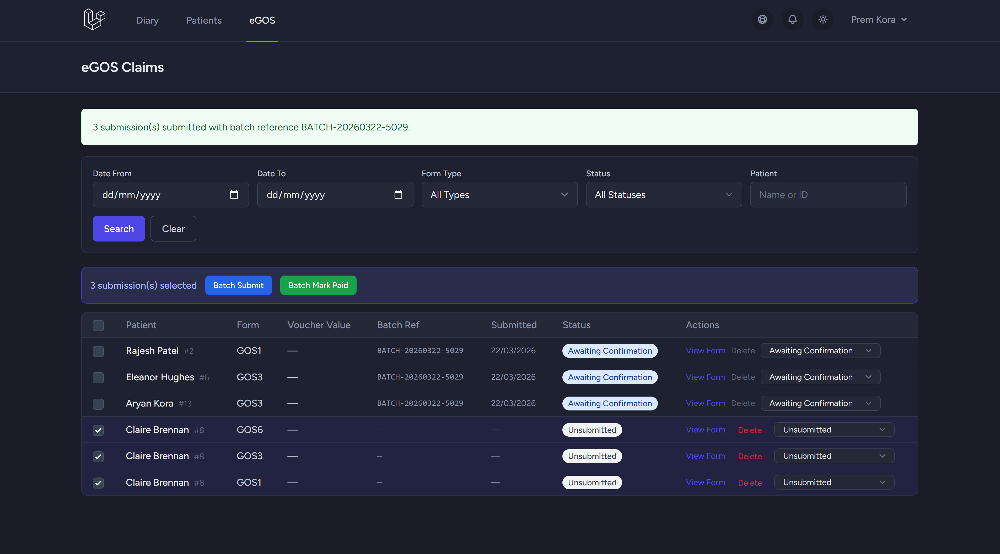
*eGOS claims table with batch actions*

### Appointment Diary

Week and day view time-grid calendar running 08:00–20:00. Appointment blocks are positioned and sized by time. Colour coding: Booked (green), Confirmed (blue), Completed (purple), Did Not Attend (red), Cancelled (grey).

Clicking an empty slot opens the booking form pre-filled with that time. There's a live patient search autocomplete and double-booking prevention with overlap detection. A date picker lets you jump to any week or day directly.

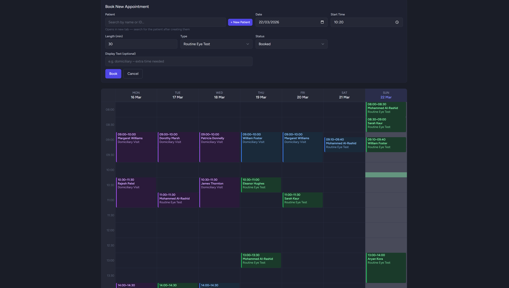
*Week view - colour-coded appointments, click-to-book*

### Examination Records

Spectacle examinations with four tabs:

- **History & Symptoms** - GOS context, last exam date, reason for visit, personal/family/ocular history, 54 medication checkboxes, patient flags. Set Default buttons per text field.
- **Ophthalmoscopy** - Right and left eye findings across 13 fields (pupils, cornea, C/D ratio, fundus, macula, etc.). Copy Right to Left button, set default buttons per eye.
- **Further Investigative Techniques** - IOP with Now buttons, cover test, visual fields, motility, Amsler, keratometry, NPC, stereopsis, colour vision, amplitude of accommodation.
- **Refraction** - Full prescription tables (current, previous, retinoscopy, subjective) with SPH/CYL/Axis/Prism/VA/Near Add, diagonal prism direction support, PD measurements, outcome, recommendations, NHS voucher dropdowns (A–H), examination comment.

New exams carry forward relevant data from the last signed exam (history notes, medications, IOP method, colour vision). Tab memory means saving a tab brings you back to that tab, not the first one. Sign-off stamps `signed_at` and triggers PDF generation. Unsigned exams can be deleted; signed ones are protected.

### Notifications & Queue System

When an appointment is created, `AppointmentObserver` dispatches `SendAppointmentReminderJob`. The `NotificationStrategyFactory` picks the right channel: email if the patient has one, SMS if they have a mobile but no email, letter as a last resort. No patient gets silently skipped.

Day-before reminders run via a scheduled command at 08:00, using a separate `day_before_notified_at` column so they don't interfere with creation notifications.

PDF examination reports are generated by `GenerateExaminationReportJob` on sign-off, stored to `storage/app/private/reports/`, and linked from the patient's exam history.

```
Appointment created
  -> AppointmentObserver
    -> SendAppointmentReminderJob
      -> NotificationStrategyFactory
        -> Email / SMS / Letter strategy
          -> appointment.notified_at stamped
```

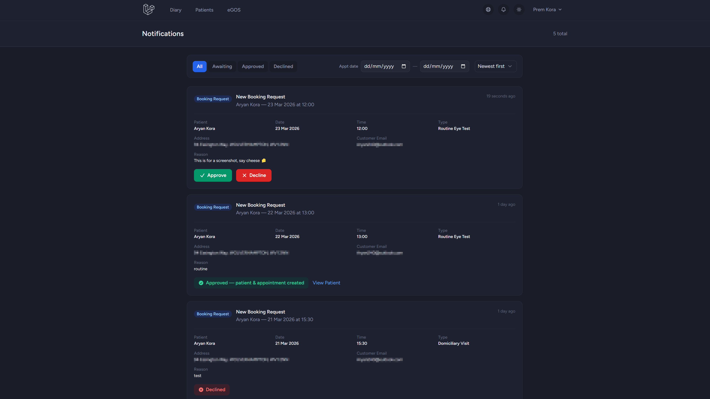
*Admin notifications panel*

---

## Architecture

### Design Patterns

| Pattern | Where | Why |
|---|---|---|
| Repository | `app/Contracts/` + `app/Repositories/` | Query logic out of controllers; swap to a cached implementation with one line |
| Factory | `app/Factories/ExaminationFactory` | Creates parent exam + 4 child tab rows inside a single `DB::transaction()` |
| Factory | `app/Factories/NotificationStrategyFactory` | Picks the right notification channel per patient |
| Observer | `app/Observers/AppointmentObserver` | Appointment created → reminder dispatched |
| Observer | `app/Observers/ExaminationObserver` | Exam signed → PDF job dispatched (guards on `wasChanged('signed_at')`) |
| Strategy | `app/Notifications/Strategies/` | Swappable notification channels |

The ExaminationFactory's transaction matters: without it, a failure on any child row leaves an orphaned exam record with missing tabs, which breaks every eager-load that expects all four to exist.

The ExaminationObserver hooks into `updated` rather than `created` because the exam record is blank when first created - the PDF should only generate at sign-off.

### Key Decisions

**Flat columns on `exam_refraction` (93 columns)** — Normalising to `exam_rx_entries` looked cleaner but meant 8 `updateOrCreate` calls per save and `groupBy` gymnastics on every load, for a form that just renders and saves. Not worth it.

**RESTRICT on patient FK relationships** — Silently nulling a patient's GP association when a doctor is deleted would be a quiet data integrity problem in a medical system. RESTRICT forces you to explicitly reassign the patients first.

**PHP backed enums** — 14+ backed string enums in `app/Enums/` with a shared `HasOptions` trait. One source of truth across validation, Blade dropdowns, repository filters, and jobs.

---

## What's Real vs Stubbed

| Feature | Status | Notes |
|---|---|---|
| Appointment reminder emails | Real | Full Mailable, log driver locally - swap `MAIL_MAILER` in `.env` for production |
| Day-before reminders | Real | Scheduled command, dispatches via Strategy pattern |
| Queue infrastructure | Real | Observer → dispatch → worker → process chain fully working |
| PDF examination reports | Real | DomPDF, stored to disk, downloadable from patient profile |
| GOS form saving | Real | Form data serialised to JSON, repopulates on reopen |
| SMS notifications | Stubbed | Logs intent - needs a provider (e.g. Twilio) |
| Letter notifications | Stubbed | Logs intent - needs a generation template |

---

## Project Structure

```
app/
├── Console/Commands/   # SendDayBeforeReminders
├── Contracts/          # Repository interfaces, NotificationStrategy interface
├── Enums/              # 14+ backed string enums + HasOptions trait
├── Factories/          # ExaminationFactory, NotificationStrategyFactory
├── Http/Controllers/   # All controllers
├── Jobs/               # Reminder and PDF generation jobs
├── Mail/               # AppointmentReminderMail
├── Models/             # 13+ Eloquent models
├── Notifications/
│   └── Strategies/     # Email, SMS, Letter strategies
├── Observers/          # AppointmentObserver, ExaminationObserver
├── Providers/          # AppServiceProvider, RepositoryServiceProvider
├── Repositories/       # Eloquent implementations
└── Services/           # GosEligibilityService
research/
├── BLINK_REFERENCE.md  # Field-level docs of the reference software
└── FINAL_SCHEMA.md     # Agreed DB schema written before any migrations
research/transcripts/   # Full Claude Code conversation history (raw, unedited)
resources/views/
├── diary/              # Time-grid calendar
├── egos/               # eGOS claims management
├── examinations/       # 4-tab exam form + PDF report template
├── gos/                # GOS1, GOS3, GOS6, GOS18 printable forms
└── patients/           # Patient index, show, create, edit
```

---

## AI Transcripts

The full conversation history with Claude Code is in `research/transcripts/`. Raw and unedited.
